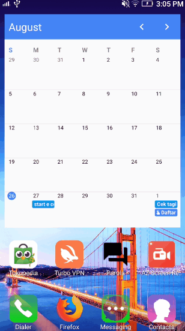
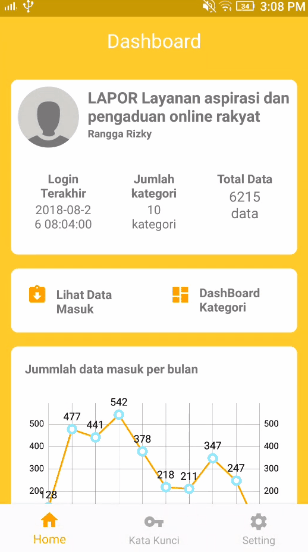

# PAROLA ANDROID
Android Application of my Final Project Using MVP Architecture
you can find web service here https://github.com/rangga-rizky/parola

this is a android version of Parola. this is build with MVP Architecture
What can Parola do ?
1. Text Categorization using Correlation Measurement
2. Topic Modelling with Latent Dirchlect Allocation

about LDA baca disini https://medium.com/@ranggaantok/topic-modelling-menggunakan-latent-dirchlect-allocation-3fdf979ffd05

# Home

# Keyword List

# Wordcloud

